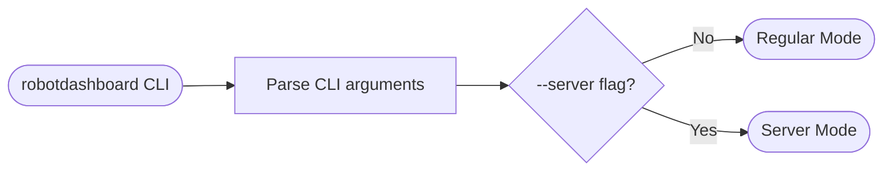
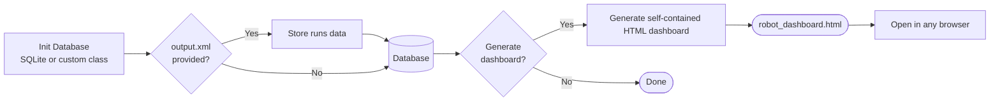
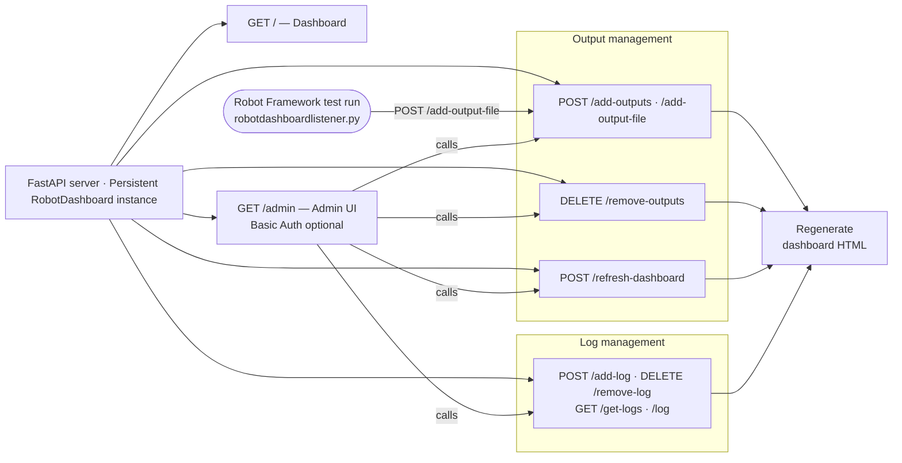

# Architecture

An overview of how `robotdashboard` is structured internally, from CLI invocation through to a rendered dashboard, in both Regular Mode (one-off HTML generation) and Server Mode (a persistent FastAPI instance).

## Regular Mode

The default mode: process one or more `output.xml` files into a database, then generate a single self-contained HTML dashboard.

## Server Mode

Started with `--server`, this keeps a persistent `RobotDashboard` instance alive behind a FastAPI app, so outputs and logs can be pushed in continuously (e.g. from CI) without re-invoking the CLI each time.

> **Tip:** For the full endpoint reference (request/response shapes, auth), see [Dashboard Server](/dashboard-server.md). For pushing results automatically from a test run, see [Listener Integration](/listener-integration.md).
